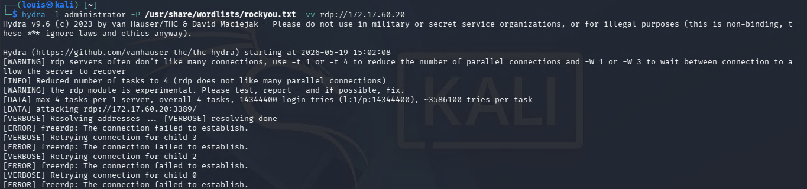
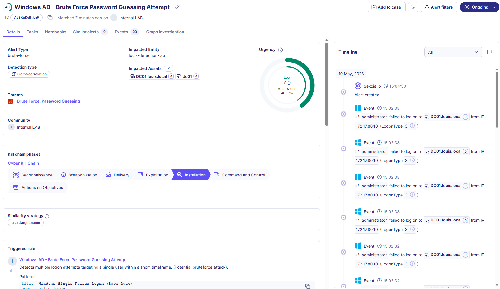

# Windows AD - Brute Force Attempt

**Rule ID:** be2fc104-3e41-4091-8525-8b57af5145ec
**Status:** experimental
**Author / Date:** Louis Ingelbrecht | 2026-05-19

---

## 1. Core Metadata
* **Data Source:** Windows AD DC Security Logs - NXlog
* **MITRE Tactic:** Credential Access
* **MITRE Technique:** T1110-001 Password Guessing https://attack.mitre.org/techniques/T1110/001/, T1110-003 Password Spraying https://attack.mitre.org/techniques/T1110/003/ 
* **Severity:** Medium — *Deserves an analyst's attention, but the attack was unsuccessful so no immediate breach has occurred.*
* **Sigma File Path:** `Detection-Engineering\Rules\Active_Directory\cor_win_ad_brute_force_t1110_001.yaml`

## 2. Threat Description
Adversary using an automated tool to either: attempt to guess the password for a single account, or try different passwords on different accounts. Tools such as Hydra use a public or custom wordlist filled with common/weak passwords, attempting to login with each password until a login succeeds, or they run out of passwords to try.

An unsuccessful attempt means the perimeter or account lockouts held, but it reveals active reconnaissance or an ongoing attack vector. If left unmonitored, an adversary may eventually find a valid credential pair, leading to system-wide compromise if the credentials for a high privilege account are obtained. Lower privileged accounts could still be used to move laterally across the system or escalate privileges. Once an attacker has unrestricted access to the system, this could lead to exfiltration/destruction/encryption of sensitive data, ransomware deployment, service obstruction,... 

Brute forcing is a well-known and commonly used technique. There are numerous real-world incidents that involved a form of password guessing or spraying, such as in the 2016 Ukraine Electric Power Attack by Sandworm Team.

## 3. Detection Strategy
* **Detection Logic:** This rule looks for multiple failed logon events within a short amount of time, against 1 or any amount of users, without a subsequent successful authentication from the same source. A user mistyping his password one or two times doesn't classify as malicious behavior, but more than 10 (or sometimes in the hundreds or thousands) failed logins coming from a single host indicate the use of malicious scripts or tools to guess/spray passwords.
* **Key Fields Evaluated:**
  * `action.id`: This is how we detect that the logon failed (**4625**).
  * `user.target.name`: Knowing if one or multiple users are targeted helps us determine if we are dealing with a password guessing or password spraying attack.
  * `source.ip`: If the source IP address matches across all these failed logon events, we can determine that there is one host/person trying to gain unauthorized access to user credentials.

## 4. Execution & Validation
* **How to Trigger:**
  1. Execute Hydra brute force attack from attacker machine: 
     ```bash
     hydra -l <user> -P <path-to-wordlist> -vv <service>://<target-ip>
     ```
  2. If Hydra or a similar tool is not an option, one can simply attempt to log in using the wrong password 10 times within 5 minutes.
* **Trigger Evidence:**
  * **Sekoia Alert ID:** ALEKuKcBtkhF
  * **Timestamp:** 2026-05-19 15:04:50
  * **Screenshots:**
    
    

## 5. Maintenance & Tuning
* **Known False Positives:**
  * A user trying to legitimately log in but mistyping his password over 10 times (unlikely).
  * A misconfigured service account, scheduled task, or cron job running with an expired password that continuously hammers the Domain Controller.
  * Internal vulnerability scanners or automated security posture assessment tools running credential audits.
* **Tuning Notes:**
  * Scope of monitored users, time interval, and threshold of failed login events could be tuned to adapt to an organization's needs.
  * **Threshold Tuning:** Consider raising thresholds for environments with large internal networks to account for automated internal background noise, or lowering the threshold for high-value targets (e.g., Domain Admins).

## 6. Research Sources
* https://attack.mitre.org/techniques/T1110/
* https://github.com/GuilleVENT/pentesting_tools/blob/main/HYDRA_Guide.md