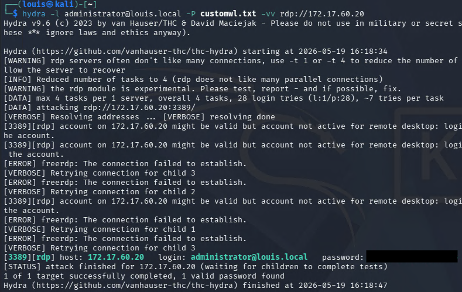
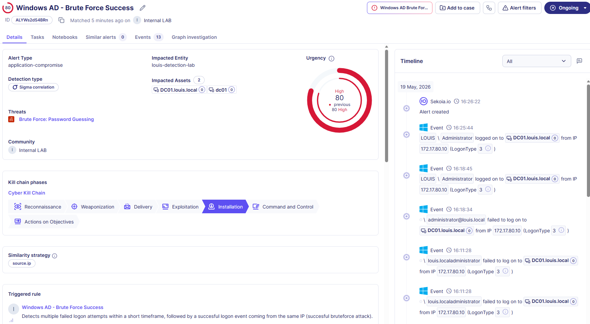

# Windows AD - Brute Force Success

**Rule ID:** ac8e3ddf-3cb1-4f3b-ab71-bb29fc1a2cb0
**Status:** experimental
**Author / Date:** Louis Ingelbrecht | 2026-05-19

---

## 1. Core Metadata
* **Data Source:** Windows AD DC Security Logs - NXlog
* **MITRE Tactic:** Credential Access
* **MITRE Technique:** T1110-001 Password Guessing https://attack.mitre.org/techniques/T1110/001/, T1110-003 Password Spraying https://attack.mitre.org/techniques/T1110/003/ 
* **Severity:** Critical — *Indicates succesful intrusion into the system. Immediate response needed.*
* **Sigma File Path:** `Detection-Engineering\Rules\Active_Directory\cor_win_ad_brute_force_success_t1110_001.yaml`

## 2. Threat Description
Adversary using an automated tool to either: attempt to guess the password for a single account, or try different passwords on different accounts. Tools such as Hydra use a public or custom wordlist filled with common/weak passwords, attempting to login with each password until a login succeeds, or they run out of passwords to try.

A successful brute force attack could lead to system-wide compromise if the credentials for a high privilege account are obtained. Lower privileged accounts could still be used to move laterally across the system or escalate privileges. Once an attacker has unrestricted access to the system, this could lead to exfiltration/destruction/encryption of sensitive data, ransomware deployment, service obstruction,... 

Brute forcing is a well-known and commonly used technique. There are numerous real-world incidents that involved a form of password guessing or spraying, such as in the 2016 Ukraine Electric Power Attack by Sandworm Team.

## 3. Detection Strategy
* **Detection Logic:** This rule looks for multiple failed logon events within a short amount of time, against 1 or any amount of users, followed by a successful logon by the same host/source ip. A user mistyping his password one or two times doesn't classify as malicious behavior, but more than 10 (or sometimes in the hundreds or thousands) failed logins coming from a single host indicate the use of malicious scripts or tools to guess/spray passwords.
* **Key Fields Evaluated:**
  * `action.id`: This is how we detect that the logon failed (**4625**) or succeeded (**4624**).
  * `user.target.name`: Knowing if one or multiple users are targeted helps us determine if we are dealing with a password guessing or password spraying attack, and also helps us determine which account was compromised.
  * `source.ip`: If the source IP address matches across all these failed logon events, we can determine that there is one host/person trying to gain unauthorized access to user credentials.
  * `winlog.event_data.LogonType`: Evaluating Logon Type is crucial for tracking the execution vector. Focus on Type `3` (Network - mapping to SMB/Remote connections) or Type `10` (RDP), as automated brute-force attacks via Hydra rarely trigger as Type `2` (Interactive console).

## 4. Execution & Validation
* **How to Trigger:**
  1. Execute Hydra brute force attack from attacker machine (in this test, I used a custom wordlist containing the correct password):
     ```bash
     hydra -l <user> -P <path-to-wordlist> -vv <service>://<target-ip>
     ```
  2. If Hydra or a similar tool is not an option, one can simply attempt to log in using the wrong password 10 times within 5 minutes, then log in using the correct password.
* **Trigger Evidence:**
  * **Sekoia Alert ID:** ALYWs2dS4BRn
  * **Timestamp:** 2026-05-19 16:26:22
  * **Screenshots:**
    
    

## 5. Maintenance & Tuning
* **Known False Positives:**
  * A user trying to legitimately log in but mistyping his password over 10 times (unlikely).
  * A misconfigured service account or legacy script that has an outdated password saved and continuously attempts to authenticate over the network automatically.
  * Expired credentials cached in the Windows Credential Manager or mobile devices syncing corporate mail apps after a domain password reset.
* **Tuning Notes:**
  * Scope of monitored users, time interval, and threshold of failed login events could be tuned to adapt to an organization's needs.
  * Consider filtering out known internal vulnerability scanners or automated IT administration hosts if they generate noise, provided their source IPs are static and secured.

## 6. Research Sources
* https://attack.mitre.org/techniques/T1110/
* https://github.com/GuilleVENT/pentesting_tools/blob/main/HYDRA_Guide.md