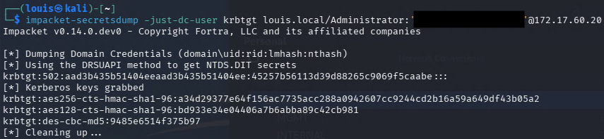
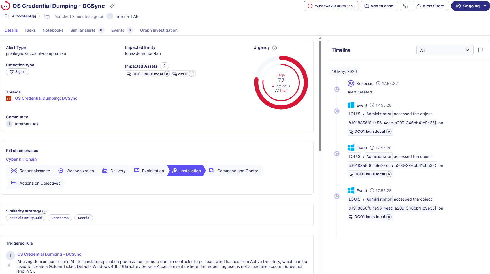

# Windows AD - OS Credential Dumping - DCSync

**Rule ID:** e31ab61b-d7fa-4a53-9310-26d92f1a1745
**Status:** experimental
**Author / Date:** Louis Ingelbrecht | 2026-05-19

---

## 1. Core Metadata
* **Data Source:** Windows AD DC Security Logs - NXlog
* **MITRE Tactic:** Credential Access
* **MITRE Technique:** T1003.006 - OS Credential Dumping: DCSync https://attack.mitre.org/techniques/T1003/006/
* **Severity:** Critical — *DCSync represents a near-total compromise of the Active Directory domain infrastructure. Immediate incident response playbooks must be initiated.*
* **Sigma File Path:** `Detection-Engineering\Rules\Active_Directory\win_ad_credential_dumping_dcsync_t1003_006.yaml`

## 2. Threat Description
Adversaries abusing a Domain Controller's API by posing as another DC to simulate the Active Directory replication process via the Directory Replication Service (DRS) Remote Protocol (`MS-DRSR`). This allows an attacker to request password hashes for any or all active domain accounts—including the highly sensitive `krbtgt` account—without needing interactive or direct memory access (like LSASS dumping) to the Domain Controller itself.

Obtained password hashes can be cracked offline or used to forge a "Golden Ticket" (a forged Kerberos Ticket Granting Ticket), providing permanent, unconstrained administrative access to any system within the Active Directory forest.

Adversary group Scattered Spider used DCSync techniques during the C0027 campaign targeting telecommunications and BPO companies in 2022.

## 3. Detection Strategy
* **Detection Logic:** This rule detects Active Directory replication requests initiated by an account that is not part of the legitimate Domain Controllers group (i.e., a standard user or service account instead of a machine account ending in `$`).
* **Key Fields Evaluated:**
  * `action.id`: Detect event **4662** (An operation was performed on an object) or event **4624** (monitoring for suspicious logons directly preceding the replication request).
  * `user.name`: A non-machine account (not ending in `$`) generating directory service access with replication permissions is highly anomalous.
  * `winlog.event_data.Properties`: **Helpful Addition:** To reduce false positives and ensure high-fidelity detection, the rule must validate the specific Access Mask (`0x100` - Control Access) and look for the specific extended replication GUIDs inside the Properties field:
    * `1131f6aa-9c07-11d1-f79f-00c04fc2dcd2` (DS-Replication-Get-Changes)
    * `1131f6ad-9c07-11d1-f79f-00c04fc2dcd2` (DS-Replication-Get-Changes-All)
    * `89eac34d-bc56-11d1-a7d4-00c04fc2dcd2` (DS-Replication-Get-Changes-In-Filtered-Set)

## 4. Execution & Validation
* **How to Trigger:**
  1. Execute a remote DCSync request from an attacker machine using `impacket-secretsdump`:
     ```bash
     secretsdump.py -k -id 500 -just-dc-user krbtgt domain.local/username@<DC_IP>
     ```
  2. Alternatively, run Mimikatz locally on a compromised domain-joined asset where the current user session has been granted replication rights:
     ```cmd
     mimikatz.exe "lsadump::dcsync /user:krbtgt" exit
     ```
* **Trigger Evidence:**
  * **Sekoia Alert ID:** ALfxxa4abFgg
  * **Timestamp:** 2026-05-19 17:55:32
  * **Screenshots:**
    
    

## 5. Maintenance & Tuning
* **Known False Positives:**
  * Legitimate synchronization tools, directory connectors, or identity providers (e.g., Azure AD Connect / Entra Connect, identity management platforms, or automated synchronization service accounts) configured with DRS privileges.
  * Internal vulnerability or configuration assessment tools (e.g., PingCastle, BloodHound Enterprise) running authorized audits.
* **Tuning Notes:**
  * **Allowlist Management:** Filter out authorized sync service accounts by their explicit User Principal Name (UPN) or Distinguished Name (DN) strings. Ensure these exceptions are tightly scoped to specific source IPs or hosts.
  * **Enhancement:** Combine this rule with Event ID **4662** tracking object class `ffffffff-ffff-ffff-ffff-ffffffffffff` (which targets the root of the domain tree where replication rights are assigned).

## 6. Research Sources
* https://attack.mitre.org/techniques/T1003/006/
* https://hacktricks.wiki/en/windows-hardening/active-directory-methodology/dcsync.html
