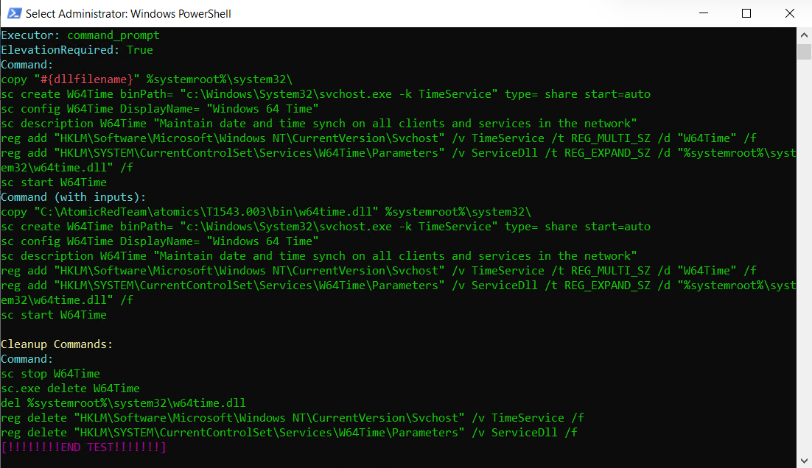
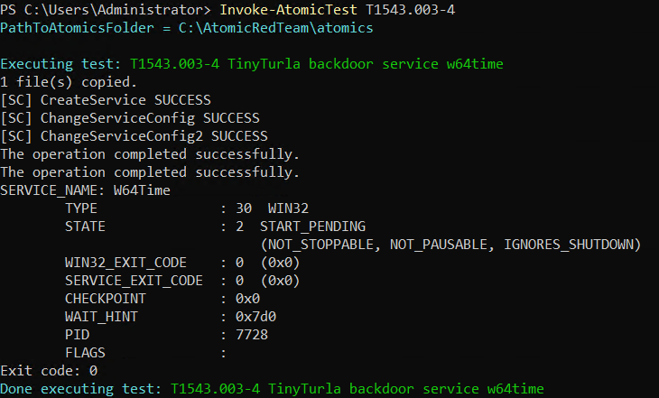
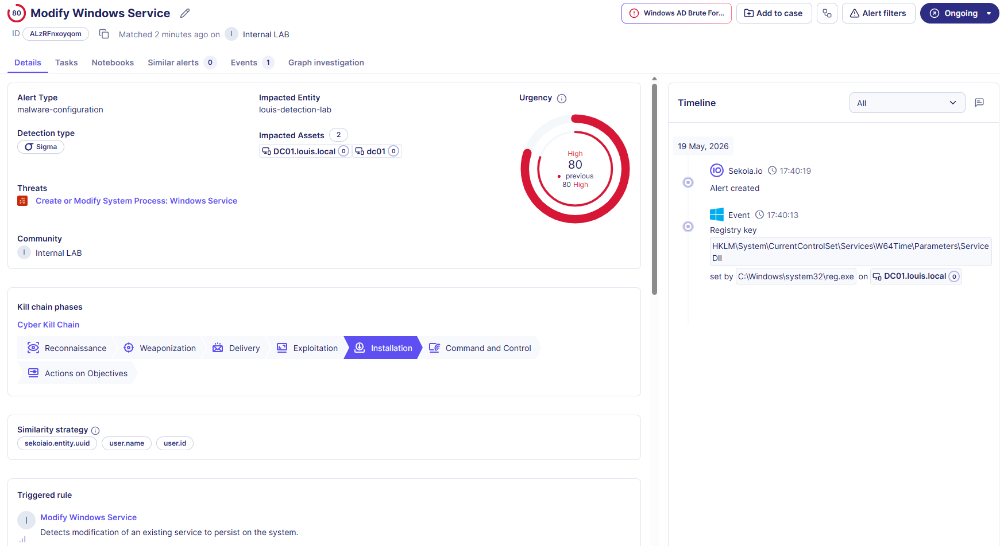

# Windows AD - Modify Windows Service

**Rule ID:** 61b0eb40-1f2b-4542-8ad6-293338b91879
**Status:** experimental
**Author / Date:** Louis Ingelbrecht | 2026-05-19

---

## 1. Core Metadata
* **Data Source:** Windows AD DC Security Logs - NXlog
* **MITRE Tactic:** Persistence, Privilege Escalation
* **MITRE Technique:** T11543.003 - Create or Modify System Process: Windows Process https://attack.mitre.org/techniques/T1543/003/
* **Severity:** High — *Indicates potential persistence/Privilege Escalation*
* **Sigma File Path:** `Detection-Engineering\Rules\Active_Directory\win_ad_create_or_modify_system_process_t1543_003.yaml`

## 2. Threat Description
Adversaries may modify Windows services to execute malware or malicious scripts to persist on a system. This can be done by directly modifying the registry keys that hold service configurations (`HKLM\SYSTEM\CurrentControlSet\Services\`). Legitimate or legacy Windows services can be hijacked to point to malicious payloads, which are then automatically executed under local administrative parameters at system boot.

Successful modification of these registry hives allows an adversary to maintain undetected access to a system (e.g., installing a backdoor or reverse shell), or escalate privileges, because services are executed natively under `NT AUTHORITY\SYSTEM` privileges.

There are many documented cases of threat actors modifying Windows services to perform malicious activities, such as during the 2016 Ukraine Electric Power Attack.

## 3. Detection Strategy
* **Detection Logic:** This rule detects the use of `reg.exe` or direct registry events modifying a service's configurations to load a custom DLL or change the binary path. 
  * **Why is this suspicious?** Legitimate Windows services are typically modified or created via formal management channels like `sc.exe`, PowerShell (`Set-Service`), or API calls. An adversary interacting directly with `HKLM\SYSTEM\CurrentControlSet\Services\<ServiceName>` using a command-line tool like `reg.exe` is highly characteristic of evasion techniques attempting to bypass standard endpoint service auditing. Specifically, adding a `ServiceDll` value under a service's `Parameters` subkey forces the hosting process (`svchost.exe`) to execute arbitrary attacker code.
* **Key Fields Evaluated:**
  * `action.id`: Detects Sysmon Event ID **13** (Registry Value Set) or Windows Security Event ID **4657** (A registry value was modified).
  * `process.name`: Tracks the execution of the command-line registry utility (`reg.exe`).
  * `user.name`: To determine which user context is attempting to tamper with the system services hive.
  * `action.properties.Details`: To evaluate the exact key path and parameters modified—specifically targeting strings containing `\Services\` paired with modifications to binary paths (`ImagePath`) or service DLL references (`ServiceDll`).

## 4. Execution & Validation
* **How to Trigger:**
  1. Manually add or modify a service registry key using an elevated Command Prompt via `reg.exe` to simulate a hijacked parameters configuration:
     ```cmd
     reg add "HKLM\SYSTEM\CurrentControlSet\Services\AppReadiness\Parameters" /v ServiceDll /t REG_EXPAND_SZ /d "C:\Windows\Temp\malicious.dll" /f
     ```
  2. Alternatively, invoke the automated Atomic Red Team framework test case **T1543.003 - Test #4 (Modifying Service Registry Keys with reg.exe)**.
* **Trigger Evidence:**
  * **Sekoia Alert ID:** ALzRFnxoyqom
  * **Timestamp:** 2026-05-19 17:40:19
  * **Screenshots:**
    
    
    

## 5. Maintenance & Tuning
* **Known False Positives:**
  * Legacy application installers, custom internal software deployments, or third-party patch management tools that utilize custom scripts to manipulate or patch services via raw registry insertions during maintenance windows.
  * System administrative tools or host monitoring utilities verifying registry compliance configurations.
* **Tuning Notes:**
  * Scope out frequent modifications to specific, non-critical service paths generated by trusted installers if they trigger recurring false positives, provided the parent process is verified and signed.
  * Pair this rule with process creation tracing (Sysmon Event ID 1) to identify if the service was subsequently started or triggered via command-line flags (`net start` / `sc start`).

## 6. Research Sources
* https://attack.mitre.org/techniques/T1543/003/
* https://www.atomicredteam.io/docs/atomics/T1543.003
